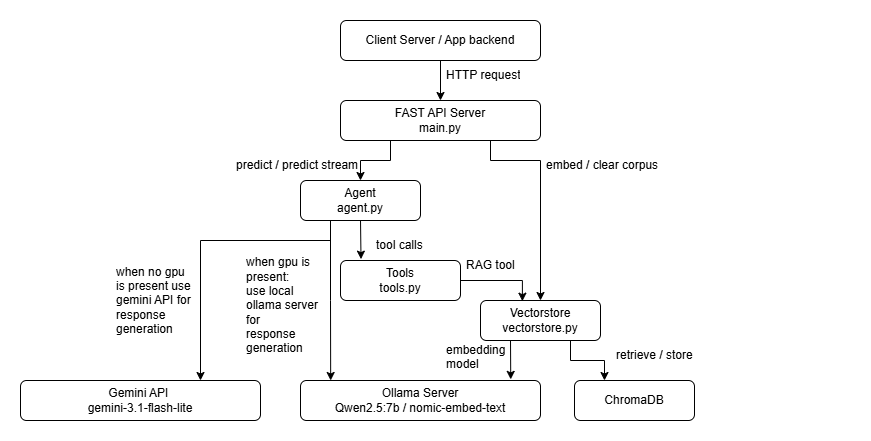
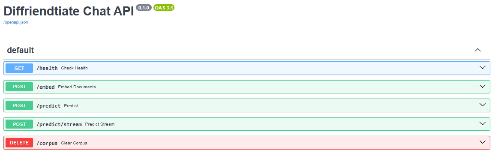

# Chatbot Service

Feature to ask questions to an LLM and retrieve contextually grounded answers

By using an agentic LLM with access to tools, such as information retrieval

If user uploaded file, file content is passed into the model whole.

Else the LLM would determine the need for additional tool usage to provide an answer such as searching the database

If all is well (pray), LLM will send correct response back to user

## Design Diagram


## Endpoints


| Method | Endpoint | Description | Inputs | Return |
| :--- | :--- | :--- | :--- | :--- | 
| **GET** | `/health` | Returns server healthy | None | Success if healthy
| **POST** | `/embed` | Embed documents into vectorstore | room_id, <br> document urls | result of operation, <br> successful file names, <br> dictionary of unsuccessful file names + reasons, <br> total chunks embeded, |
| **POST** | `/predict` | Post a question for answering, returns response in one shot <br> message_chain input is a list of the current conversation chain (i.e. conversation history + current question (last item)) <br> Example: message_chain = ```'[{"role": "user", "content": "my name is xxx"}, {"role": "assistant", "content": "hi xxx"}, {"role": "user", "content": "what is my name?"}]'``` | message_chain, <br>room_id,<br>directly uploaded file | answer,<br>sources of information, <br> full message chain,|
| **POST**| `/predict/stream` | Post a question for answering, streams response <br> The response will consists of Server-Sent Events (SSE) with headers: <br> - token: The token generated by LLM <br> - tool_start: The message indicating tool call <br> - tool_end: The event indicating end of tool call <br> - sources: The sources of information used during generation <br> - chain: The full chain of the conversation <br> - done: Final flag indicating end of response <br><br> * refer to /predict for input format info | message_chain, <br>room_id,<br>directly uploaded file | streamed response of /predict <br> *Tool call messages will appear as one event, while LLM tokens are sent token by token |
| **DELETE**| `/corpus` | Delete the corpus of the provided room id | room_id | result of operation |

## Techstack
- FASTAPI
- LangChain
- ChromaDB (Database)

## Models
- Embedding: nomic-embed-text (ollama)

If GPU is detected / Used
- Generation: Qwen2.5:7b (ollama)

If no GPU is detected / Used
- Generation: gemini-3.1-flash-lite (Gemini API)

## Files
### main.py
- Handles the FASTAPI server, routing and return of all APIs
- handles routing to relevant components, agent, vectorstore, etc.
- Uses pydantic to validate input and outputs

### agent.py
- Handles the code for the agentic model
- Uses langgraph to expose tools for model to use
- Handles handling raw LLM responses and processing into return friendly format

### tools.py
- Handles and defines the tools accessible to the model
- Global tools are given to every agent
- Room Specific tools are only available if room_id is specified in API
- Current Tools:

  | Tool | Description | Type |
  | :--- | :--- | :--- |
  | search_corpus | Perform retrieval of relevant information from database | Room Specific |
  | read_file | reads file content of uploaded file | Only if file is uploaded manually |

### vectorstore.py
- Handles tasks related to the vectorstore / documents
    - Reading Documents
    - Embed
    - Retrieve document chunks
    - Delete corpus

### models.py
- File to define all pydantic models
    - Maintains 1 source of truth for all files requiring reference to pydantic models

## Limitations / Future work
- Limited to only text based documents (PDF, TXT, DOCX)
- Does not extract information from images or any other media type
- Currently only accepts manually uploading of 1 file (not used in main app)
- Have not tested extensively
    - Multiple file in database (same / different room documents)
    - Both uploaded file and search (not used in main app)
    - Response accuracy
    - Consistentency of tool usage
    - Simultaneous requests